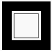
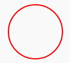
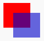
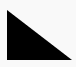
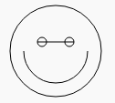
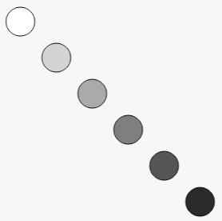

# Drawing

Canvas is a JavaScript drawing library, you can use to draw in the browser or
in NodeJS

<a href="https://developer.mozilla.org/en-US/docs/Web/API/Canvas_API">About JavaScript Canvas</a>

<pre>
const Canvas = require('canvas')
const canvas = new Canvas(200,200)
const ctx = canvas.getContext('2d')

ctx.fillStyle = "green";
ctx.fillRect(10, 10, 100, 100);

canvas.toDataURL()
</pre>

You can use the canvas module to draw and just call canvas.toDataURL() to
output to the screen. (see below)

<pre>
var Canvas = require('canvas')
  , Image = Canvas.Image
  , canvas = new Canvas(200, 200)
  , ctx = canvas.getContext('2d');

ctx.font = '30px Impact';
ctx.rotate(.1);
ctx.fillText("Awesome!", 50, 100);

var te = ctx.measureText('Awesome!');
ctx.strokeStyle = 'rgba(0,0,0,0.5)';
ctx.beginPath();
ctx.lineTo(50, 102);
ctx.lineTo(50 + te.width, 102);
ctx.stroke();

canvas.toDataURL()
</pre>

### 1. Write a JavaScript program to draw the following rectangular shape.

Expected Output :     

<pre>
const Canvas = require('canvas')
const canvas = new Canvas(200,200)
const ctx = canvas.getContext('2d')

</pre>

### 2. Write a JavaScript program to draw a circle.

Expected Output :    

<pre>
const Canvas = require('canvas')
const canvas = new Canvas(200,200)
const ctx = canvas.getContext('2d')

</pre>

### 3. Write a JavaScript program to draw two intersecting rectangles, one of which has alpha transparency.

Expected Output :     

<pre>
const Canvas = require('canvas')
const canvas = new Canvas(200,200)
const ctx = canvas.getContext('2d')

</pre>

### 4. Write a JavaScript program to draw the following right-angled triangle.

Expected Output :     

<pre>
const Canvas = require('canvas')
const canvas = new Canvas(200,200)
const ctx = canvas.getContext('2d')

</pre>

### 5. Write a JavaScript program to draw the following diagram [use moveto() function].

Expected Output :    

<pre>
const Canvas = require('canvas')
const canvas = new Canvas(200,200)
const ctx = canvas.getContext('2d')

</pre>

### 6. Write a JavaScript program to draw the following diagram [diagonal, white to black circles].

Expected Output :     

<pre>
const Canvas = require('canvas')
const canvas = new Canvas(200,200)
const ctx = canvas.getContext('2d')

</pre>

[Index](/)
